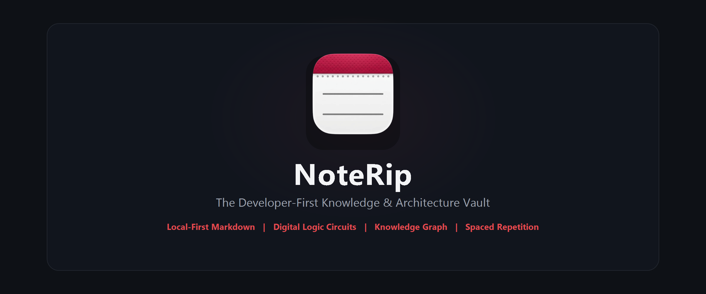

<div align="center">
  

  <br />
  <br />

  # NoteRip 📝⚡

  **The Developer-First Knowledge & Architecture Vault**  
  *Ultra-fast, local-first, distraction-free PKM built with Tauri v2, Rust & React 19.*

  <br />

  [](https://github.com/oxiys/NoteRip/releases/tag/v0.2.0)
  [](https://github.com/oxiys/NoteRip/releases)
  [](https://v2.tauri.app/)
  [](https://www.rust-lang.org/)
  [](LICENSE)

  <br />

  [📥 Download Latest Release](https://github.com/oxiys/NoteRip/releases/tag/v0.2.0) • [✨ Key Features](#-key-features) • [⚡ Architecture Circuits](#-computer-architecture--digital-circuits-in-markdown) • [⌨️ Shortcuts](#️-keyboard-shortcuts) • [🚀 Getting Started](#-getting-started)

</div>

---

## 💡 Overview

**NoteRip** is an elite desktop personal knowledge management (PKM) and note-taking environment engineered for computer science students, software engineers, and researchers.

Unlike traditional web-wrapped tools, NoteRip is powered by **Tauri v2** and **Rust** to provide instant startup, low memory footprint, and complete local-first privacy. Your notes remain plain `.md` files on your disk, always accessible and fully under your ownership.

---

## ✨ Key Features

### 🎨 Crimson Noir Frameless UI
- **Linear & Raycast Inspired Aesthetics**: Deep obsidian surfaces (`#0E1116`), card elevations (`#171B22`), subtle borders (`#272C36`), and refined Crimson accents (`#E5484D`).
- **macOS Style Traffic Lights**: Frameless borderless window with interactive top-right traffic lights (🟡 Minimize, 🟢 Maximize/Restore, 🔴 Close) and smooth native drag-region physics.
- **Distraction-Free Layout**: Collapsible left navigation sidebar, top command bar with quick capture, clean typography with generous 8px-grid spacing, and a docked right properties inspector for backlinks and tags.

### ⚡ Computer Architecture & Digital Circuits in Markdown
Write and simulate hardware logic schematics natively inside your markdown notes:
- **Interactive Logic Gates**: Support for `AND`, `OR`, `NOT`, `XOR`, `NAND`, `NOR`, and `XNOR` with ANSI/IEEE schematic symbols.
- **Live Signal Propagation**: Click any input pin (`0` / `1`) to toggle states; watch wires light up in glowing Crimson (HIGH) or dark gray (LOW) in real-time.
- **Automatic Truth Tables**: One-click generation of complete $2^N$ truth tables calculated from your circuit equations.
- **CPU Datapath Modules**: Build high-level architecture diagrams with `ALU`, `MUX`, `REG` (Register Files), `D_FF` (Flip-Flops), and Memory blocks.
- **Clock & Bus Waveforms (`timing`)**: Render clock transitions (`CLK`), write-enable pulses (`WE`), and multi-bit data buses directly in Markdown.

### 🌐 Bidirectional WikiLinks & 2D Physics Graph
- **Interconnected Knowledge**: Link notes seamlessly with `[[Note Name]]` or alias links `[[Note Name|Display Text]]`.
- **Force-Directed Graph**: Explore knowledge clusters using D3 force simulation with live physics, tag clustering, and instant navigation.

### 🃏 Spaced Repetition (Flashcards)
- **Active Recall**: Test yourself with integrated flashcards and cloze deletions.
- **Dedicated Study Decks**: Separate standalone cards from raw notes to keep your vault clean while mastering technical concepts.

### 💻 Native Multi-Language Code Runner
- **Direct Execution**: Compile and run code snippets in **C**, **C++**, and **Java** without leaving the app.
- **Integrated Terminal Output**: Real-time stdin/stdout feedback powered by native Rust sub-processes.

### 🔒 Local-First & 1-Click Git Sync
- **Zero Cloud Lock-in**: Your vault is just a folder of Markdown files.
- **Automated Git Backup**: One-click commit and push to remote repositories (GitHub, GitLab, self-hosted Gitea).

---

## ⚡ Computer Architecture & Digital Circuits in Markdown

Use the ` ```circuit ` or ` ```logic ` code block directly inside any note:

### 1. Full Adder (1-Bit)
```circuit
# Full Adder con carry
IN A = 1, B = 0, Cin = 1

XOR xor1 = A, B
XOR Sum = xor1, Cin

AND and1 = A, B
AND and2 = xor1, Cin
OR Cout = and1, and2

OUT Sum, Cout
```

### 2. CPU Datapath Semplificata
```circuit
# Schema Datapath CPU (Fetch - Decode - Execute)
IN CLK = 1, RST = 0

REG PC [Program Counter 32b] [CLK: CLK, RST: RST] -> [OUT: pc_out]
BLOCK IMEM [Instruction Memory] [A: pc_out] -> [INSTR: instr]
REG RF [Register File] [CLK: CLK, RA: instr] -> [RD1: op_a, RD2: op_b]
ALU ALU [Arithmetic Logic Unit] [A: op_a, B: op_b] -> [RES: alu_res, ZERO: z_flag]
BLOCK DMEM [Data Memory] [ADDR: alu_res, CLK: CLK] -> [DATA: d_out]

OUT alu_res, z_flag, d_out
```

### 3. Timing Waveform Diagram
```timing
# Diagramma Temporale Segnali Bus & CPU
CLK   : _~_~_~_~_~_~
RESET : ~~__________
WE    : ____~~~~____
ADDR  : ===XXXX=====
DATA  : ===XXXX=====
READY : ________~~__
```

---

## ⌨️ Keyboard Shortcuts

| Shortcut | Action |
| :--- | :--- |
| <kbd>Ctrl</kbd> + <kbd>K</kbd> / <kbd>Cmd</kbd> + <kbd>K</kbd> | **Command Palette** & Quick Switcher |
| <kbd>Ctrl</kbd> + <kbd>Q</kbd> / <kbd>Cmd</kbd> + <kbd>Q</kbd> | **Smart Q&A** (AI & Semantic Search) |
| <kbd>Ctrl</kbd> + <kbd>S</kbd> / <kbd>Cmd</kbd> + <kbd>S</kbd> | **Save Active Note** |
| <kbd>Ctrl</kbd> + <kbd>\</kbd> / <kbd>Cmd</kbd> + <kbd>\</kbd> | **Toggle Sidebar** |
| <kbd>[[</kbd> | **Trigger WikiLink Autocomplete** |
| <kbd>#</kbd> | **Trigger Tag Autocomplete** |

---

## 🛠️ Tech Stack

- **Native Desktop Core**: [Tauri v2](https://v2.tauri.app/) + [Rust](https://www.rust-lang.org/)
- **Frontend Framework**: [React 19](https://react.dev/) + [TypeScript](https://www.typescriptlang.org/) + [Vite](https://vitejs.dev/)
- **Styling & Icons**: [TailwindCSS](https://tailwindcss.com/) + [Lucide React](https://lucide.dev/)
- **State Architecture**: [Zustand](https://github.com/pmndrs/zustand)
- **Math & Graphs**: KaTeX, Mermaid.js, D3 Force, PrismJS

---

## 🚀 Getting Started

### Prerequisites
1. **Node.js** (v18+) and **npm**
2. **Rust** toolchain ([rustup.rs](https://rustup.rs/))
3. Windows C++ Build Tools (on Windows) or Xcode Command Line Tools (on macOS)

### Local Development
```bash
# 1. Clone the repository
git clone https://github.com/oxiys/NoteRip.git
cd NoteRip

# 2. Install dependencies
npm install

# 3. Launch Tauri Dev Server
npm run tauri dev
```

### Production Build
```bash
# Build standalone executable & Windows installers (NSIS + MSI)
npm run tauri build
```
Binaries and installers will be generated under `src-tauri/target/release/bundle/`.

---

## 📄 License

Distributed under the **MIT License**. See `LICENSE` for details.

<div align="center">
  <sub>Crafted with passion for knowledge, speed, and privacy.</sub>
</div>
